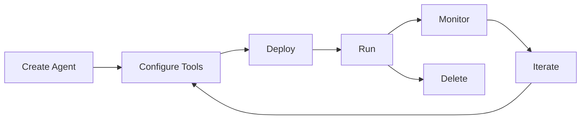

# Understanding AI Agents

AI agents in Microsoft Foundry are intelligent systems that can make decisions, invoke tools, and participate in workflows to automate complex tasks. They combine the reasoning power of large language models with the ability to take real-world actions.

## What is an AI Agent?

An agent is a configurable orchestration component that:
- **Makes decisions** based on unstructured inputs
- **Invokes tools** to retrieve knowledge or take actions
- **Participates in workflows** independently or collaboratively
- **Operates within a secure runtime** with enterprise governance

Agents are foundational to real process automation, moving beyond simple chatbots to systems that can handle complex, multi-step workflows.

## Core Components

Every agent consists of three essential components:

### 1. Model (LLM)

The model powers reasoning and language understanding. You can choose from:
- **Azure OpenAI models**: GPT-4o, GPT-4, GPT-3.5
- **Foundry Direct models**: DeepSeek, xAI, and other cutting-edge models
- **Partner models**: Meta Llama, Cohere, Anthropic Claude

<Note>
Different models have different capabilities. GPT-4o is recommended for most agent scenarios due to its strong reasoning and tool-calling abilities.
</Note>

### 2. Instructions

Instructions define the agent's goals, behavior, and constraints. They can be:

**Declarative**:
- **Prompt-based**: Natural language instructions combined with model configuration
- **Workflow**: YAML or code-based orchestration for multi-agent systems

**Hosted**:
- **Containerized agents**: Created and deployed in code, hosted by Foundry

Example instructions:
```
You are a helpful customer support assistant for Contoso Electronics.
Your goal is to help customers with product questions and order issues.
Always be polite and professional. If you cannot answer a question,
offer to escalate to a human agent.
```

### 3. Tools

Tools extend agent capabilities by allowing them to:
- Retrieve knowledge from documents and databases
- Execute code in sandboxed environments
- Call external APIs and services
- Search the web or enterprise data

Common tools include:
- **Code Interpreter**: Execute Python code
- **File Search**: Retrieve from uploaded documents
- **Function Calling**: Custom tool definitions
- **Azure AI Search**: Ground in indexed data
- **Azure Functions**: Integrate with enterprise systems

## Agent Workflow

Here's how an agent processes a user request:

<Steps>
  <Step title="Receive Input">
    Agent receives unstructured input (user prompt, alert, or message from another agent)
  </Step>
  
  <Step title="Analyze Request">
    Model analyzes the input and determines what actions are needed
  </Step>
  
  <Step title="Invoke Tools">
    Agent calls necessary tools to retrieve information or perform actions
  </Step>
  
  <Step title="Generate Response">
    Model synthesizes tool results into a coherent response
  </Step>
  
  <Step title="Return Output">
    Agent returns the response to the user or next agent in the workflow
  </Step>
</Steps>

## Agent Types

### Single Agent

A standalone agent that handles a specific task or domain:

```python
agent = project.agents.create_agent(
    model="gpt-4o",
    name="customer-support-agent",
    instructions="You are a helpful customer support assistant.",
    tools=[file_search_tool, function_tool]
)
```

### Multi-Agent Systems

Multiple agents working together, each with specialized roles:

- **Research Agent**: Gathers information from multiple sources
- **Analysis Agent**: Processes and analyzes collected data
- **Writing Agent**: Creates reports or content
- **Review Agent**: Validates outputs for quality

## Agent Capabilities

### Memory and Context

Agents maintain conversation history through threads:
- **Threads**: Persistent conversation sessions
- **Messages**: Individual pieces of communication
- **Context**: Automatically managed by the platform

### Tool Orchestration

Agents can:
- Call multiple tools in sequence
- Retry failed tool calls
- Parallelize independent tool invocations
- Handle complex multi-step workflows

### Error Handling

Agents handle errors gracefully:
- Retry logic for transient failures
- Fallback to alternative approaches
- Clear error messages to users
- Logging for debugging

## Agent Runtime

The Foundry Agent Service provides a production-ready runtime that:

### Orchestrates Execution
- Manages conversation state
- Coordinates tool calls
- Handles retries and timeouts
- Maintains thread history

### Enforces Safety
- Content filters for inputs and outputs
- Prompt injection protection
- Cross-prompt injection attack (XPIA) mitigation
- Policy-governed outputs

### Provides Observability
- Full conversation traces
- Tool invocation logging
- Performance metrics
- Application Insights integration

## Agent Lifecycle



1. **Create**: Define agent with model, instructions, and tools
2. **Configure**: Set up tool resources (files, indexes, etc.)
3. **Deploy**: Make agent available for use
4. **Run**: Execute agent on threads with user messages
5. **Monitor**: Track performance and behavior
6. **Iterate**: Refine instructions and configuration
7. **Delete**: Clean up when no longer needed

## Best Practices

### Designing Effective Agents

<Accordion title="Write Clear Instructions">
Be specific about:
- Agent's role and expertise
- Expected behavior and tone
- When to use which tools
- How to handle edge cases
</Accordion>

<Accordion title="Choose the Right Model">
- Use GPT-4o for complex reasoning and tool use
- Consider GPT-3.5 for simpler, cost-effective scenarios
- Test with your specific use case
</Accordion>

<Accordion title="Design Modular Tools">
- Keep tools focused on single responsibilities
- Provide clear tool descriptions
- Include examples in tool documentation
- Test tools independently
</Accordion>

<Accordion title="Implement Proper Error Handling">
- Gracefully handle tool failures
- Provide helpful error messages
- Implement retry logic where appropriate
- Log errors for debugging
</Accordion>

### Security Considerations

<Warning>
- Never include sensitive credentials in instructions
- Use managed identities for tool authentication
- Enable content filters to prevent harmful outputs
- Implement rate limiting for production agents
- Review agent outputs before deploying to production
</Warning>

## Agent Patterns

### Sequential Processing

Agent executes tools in sequence based on previous results:

```python
# Agent workflow:
# 1. Search for customer order
# 2. Get order details
# 3. Generate summary
```

### Parallel Processing

Agent invokes multiple tools simultaneously:

```python
# Agent workflow:
# 1. Search products (parallel)
# 2. Check inventory (parallel)
# 3. Get pricing (parallel)
# 4. Combine results
```

### Hierarchical Agents

Supervisor agent coordinates specialist agents:

```python
# Supervisor agent delegates to:
# - Research specialist
# - Analysis specialist
# - Writing specialist
```

## Performance Optimization

### Thread Management

- Create new threads for new conversation contexts
- Reuse threads for ongoing conversations
- Delete old threads to manage storage costs
- Monitor thread size (max 100,000 messages)

### Tool Design

- Minimize tool call latency
- Cache frequently accessed data
- Use batching for multiple operations
- Implement appropriate timeouts

### Model Selection

- Balance cost vs. capability
- Use streaming for real-time responses
- Consider region availability for latency
- Test with different models for your use case

## Next Steps

<CardGroup cols={2}>
  <Card title="Agent Overview" icon="robot" href="/foundry/agents/overview">
    Get started with Foundry Agent Service
  </Card>
  <Card title="Standard Setup" icon="gear" href="/foundry/agents/standard-setup">
    Configure enterprise-ready agents
  </Card>
  <Card title="Threads & Runs" icon="messages" href="/foundry/agents/threads-runs-messages">
    Understand agent execution
  </Card>
  <Card title="Agent Tools" icon="wrench" href="/foundry/agents/tools/code-interpreter">
    Explore available tools
  </Card>
</CardGroup>