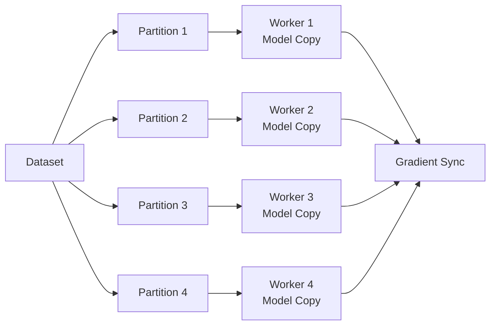

# Distributed GPU Training Guide

Distributed training splits the training workload across multiple GPUs or nodes, dramatically reducing training time for large models and datasets.

<Info>
Azure Machine Learning supports distributed training with PyTorch DDP, DeepSpeed, TensorFlow, and Horovod for both data parallelism and model parallelism.
</Info>

## What is Distributed Training?

In distributed training, you split the workload across multiple mini processors called **worker nodes**. These nodes work in parallel to speed up model training.

<CardGroup cols={2}>
  <Card title="Data Parallelism" icon="database">
    Same model on each node, different data subsets
  </Card>
  <Card title="Model Parallelism" icon="brain">
    Model split across nodes, same data
  </Card>
</CardGroup>

<Tip>
Use **data parallelism** for most workloads - it's easier to implement and sufficient for 90%+ of use cases.
</Tip>

## Data Parallelism

The data is divided into partitions equal to the number of available nodes. Each node gets a copy of the model and trains on its data subset.



**Requirements:**
- Each node must have enough memory for the full model
- Nodes synchronize gradients at batch completion
- Best for models that fit in single GPU memory

## Model Parallelism

The model is segmented into parts that run concurrently on different nodes with the same data.

**Use when:**
- Model is too large for single GPU
- Need to train models >10GB
- Have very deep networks

<Warning>
Model parallelism is more complex to implement than data parallelism and may not scale as efficiently.
</Warning>

## PyTorch Distributed Training

Azure ML supports PyTorch's native `torch.distributed` for distributed training.

### Process Group Initialization

Create process group for worker communication:

```python
import torch.distributed as dist

# Initialize process group
dist.init_process_group(
    backend='nccl',  # Use NCCL for GPU training
    init_method='env://',  # Use environment variables
)

# Get process information
world_size = dist.get_world_size()  # Total number of processes
rank = dist.get_rank()  # Global rank of current process
local_rank = int(os.environ['LOCAL_RANK'])  # Local rank on node

print(f"Process {rank}/{world_size} on GPU {local_rank}")
```

### Environment Variables

Azure ML automatically sets these variables:

| Variable | Description |
|----------|-------------|
| `MASTER_ADDR` | IP of rank 0 process |
| `MASTER_PORT` | Free port on rank 0 machine |
| `WORLD_SIZE` | Total number of processes |
| `RANK` | Global rank (0 to world_size-1) |
| `LOCAL_RANK` | Local rank on node |
| `NODE_RANK` | Node rank for multinode |

### Distributed Training Script

```python
import torch
import torch.nn as nn
import torch.distributed as dist
from torch.nn.parallel import DistributedDataParallel as DDP
from torch.utils.data import DataLoader, DistributedSampler

def main():
    # Initialize distributed training
    dist.init_process_group(backend='nccl', init_method='env://')
    
    # Get rank and local rank
    rank = dist.get_rank()
    local_rank = int(os.environ['LOCAL_RANK'])
    world_size = dist.get_world_size()
    
    # Set device
    torch.cuda.set_device(local_rank)
    device = torch.device(f'cuda:{local_rank}')
    
    # Create model and move to device
    model = YourModel().to(device)
    
    # Wrap model with DDP
    model = DDP(model, device_ids=[local_rank])
    
    # Create distributed sampler
    train_dataset = YourDataset()
    train_sampler = DistributedSampler(
        train_dataset,
        num_replicas=world_size,
        rank=rank,
        shuffle=True
    )
    
    # Create dataloader with sampler
    train_loader = DataLoader(
        train_dataset,
        batch_size=32,
        sampler=train_sampler,
        num_workers=4,
        pin_memory=True
    )
    
    # Training loop
    optimizer = torch.optim.Adam(model.parameters(), lr=0.001)
    criterion = nn.CrossEntropyLoss()
    
    for epoch in range(10):
        # Set epoch for sampler (important for shuffling)
        train_sampler.set_epoch(epoch)
        
        model.train()
        for batch_idx, (data, target) in enumerate(train_loader):
            data, target = data.to(device), target.to(device)
            
            optimizer.zero_grad()
            output = model(data)
            loss = criterion(output, target)
            loss.backward()
            optimizer.step()
            
            # Log only on rank 0
            if rank == 0 and batch_idx % 10 == 0:
                print(f"Epoch {epoch}, Batch {batch_idx}, Loss: {loss.item():.4f}")
        
        # Save checkpoint on rank 0 only
        if rank == 0:
            torch.save({
                'epoch': epoch,
                'model_state_dict': model.module.state_dict(),
                'optimizer_state_dict': optimizer.state_dict(),
            }, f'checkpoint_epoch_{epoch}.pt')
    
    # Cleanup
    dist.destroy_process_group()

if __name__ == '__main__':
    main()
```

### Submit PyTorch Distributed Job

<CodeGroup>
```python Python SDK
from azure.ai.ml import command
from azure.ai.ml.entities import ResourceConfiguration

# Define distributed job
job = command(
    code="./src",
    command="python train_distributed.py",
    environment="azureml://registries/azureml/environments/pytorch-2.0-cuda11.7/versions/1",
    compute="gpu-cluster",
    instance_count=4,  # 4 nodes
    distribution={
        "type": "pytorch",
        "process_count_per_instance": 2  # 2 GPUs per node = 8 total GPUs
    },
    resources=ResourceConfiguration(
        instance_type="Standard_NC24s_v3"  # 4x V100 GPUs per node
    ),
    display_name="pytorch-distributed-training",
    experiment_name="distributed-training"
)

returned_job = ml_client.jobs.create_or_update(job)
print(f"Job URL: {returned_job.studio_url}")
```

```yaml YAML Config
$schema: https://azuremlschemas.azureedge.net/latest/commandJob.schema.json
command: python train_distributed.py
code: ./src
environment: azureml://registries/azureml/environments/pytorch-2.0-cuda11.7/versions/1
compute: gpu-cluster
resources:
  instance_type: Standard_NC24s_v3
  instance_count: 4
distribution:
  type: pytorch
  process_count_per_instance: 2
experiment_name: distributed-training
display_name: pytorch-distributed-training
```
</CodeGroup>

<Note>
`process_count_per_instance` should equal the number of GPUs per node. Azure ML handles setting all environment variables automatically.
</Note>

## DeepSpeed

DeepSpeed enables training massive models with near-linear scalability.

### DeepSpeed Configuration

```json
{
  "train_batch_size": 64,
  "gradient_accumulation_steps": 1,
  "optimizer": {
    "type": "AdamW",
    "params": {
      "lr": 0.001,
      "betas": [0.9, 0.999],
      "eps": 1e-8
    }
  },
  "fp16": {
    "enabled": true,
    "loss_scale": 0,
    "initial_scale_power": 16
  },
  "zero_optimization": {
    "stage": 2,
    "offload_optimizer": {
      "device": "cpu",
      "pin_memory": true
    },
    "allgather_partitions": true,
    "allgather_bucket_size": 2e8,
    "reduce_scatter": true,
    "reduce_bucket_size": 2e8,
    "overlap_comm": true,
    "contiguous_gradients": true
  }
}
```

### DeepSpeed Training Script

```python
import deepspeed
import torch
import torch.nn as nn
from transformers import AutoModelForCausalLM

def main():
    # Parse DeepSpeed config
    import argparse
    parser = argparse.ArgumentParser()
    parser.add_argument('--local_rank', type=int, default=0)
    parser = deepspeed.add_config_arguments(parser)
    args = parser.parse_args()
    
    # Create model
    model = AutoModelForCausalLM.from_pretrained("gpt2-large")
    
    # Initialize DeepSpeed
    model_engine, optimizer, train_loader, _ = deepspeed.initialize(
        args=args,
        model=model,
        model_parameters=model.parameters(),
        training_data=train_dataset
    )
    
    # Training loop
    for epoch in range(args.epochs):
        for step, batch in enumerate(train_loader):
            inputs, labels = batch
            inputs = inputs.to(model_engine.local_rank)
            labels = labels.to(model_engine.local_rank)
            
            outputs = model_engine(inputs, labels=labels)
            loss = outputs.loss
            
            model_engine.backward(loss)
            model_engine.step()
            
            if step % 10 == 0:
                print(f"Epoch {epoch}, Step {step}, Loss: {loss.item():.4f}")
        
        # Save checkpoint
        model_engine.save_checkpoint('./checkpoints', epoch)

if __name__ == '__main__':
    main()
```

### Submit DeepSpeed Job

```python
from azure.ai.ml import command

job = command(
    code="./src",
    command="deepspeed train_deepspeed.py --deepspeed_config ds_config.json",
    environment="azureml://registries/azureml/environments/deepspeed-0.9.5/versions/1",
    compute="gpu-cluster",
    instance_count=4,
    distribution={
        "type": "pytorch",
        "process_count_per_instance": 4
    },
    resources=ResourceConfiguration(
        instance_type="Standard_ND96asr_v4"  # 8x A100 GPUs
    )
)

ml_client.jobs.create_or_update(job)
```

## TensorFlow Distributed Training

Use TensorFlow's `tf.distribute.Strategy` for distributed training:

```python
import tensorflow as tf
import os

def main():
    # Create distribution strategy
    strategy = tf.distribute.MultiWorkerMirroredStrategy()
    
    print(f"Number of devices: {strategy.num_replicas_in_sync}")
    
    # Create and compile model within strategy scope
    with strategy.scope():
        model = tf.keras.Sequential([
            tf.keras.layers.Dense(128, activation='relu'),
            tf.keras.layers.Dense(10, activation='softmax')
        ])
        
        model.compile(
            optimizer='adam',
            loss='sparse_categorical_crossentropy',
            metrics=['accuracy']
        )
    
    # Load data
    (x_train, y_train), (x_test, y_test) = tf.keras.datasets.mnist.load_data()
    x_train = x_train.reshape(-1, 784).astype('float32') / 255
    x_test = x_test.reshape(-1, 784).astype('float32') / 255
    
    # Create distributed dataset
    train_dataset = tf.data.Dataset.from_tensor_slices((x_train, y_train))
    train_dataset = train_dataset.shuffle(1000).batch(64)
    
    # Train model
    model.fit(
        train_dataset,
        epochs=10,
        steps_per_epoch=100
    )
    
    # Save model (only on chief worker)
    if os.environ.get('TF_CONFIG', None):
        task_type = json.loads(os.environ['TF_CONFIG'])['task']['type']
        if task_type == 'chief' or task_type == 'worker' and task_index == 0:
            model.save('outputs/model')
    else:
        model.save('outputs/model')

if __name__ == '__main__':
    main()
```

### Submit TensorFlow Job

```python
job = command(
    code="./src",
    command="python train_tensorflow.py",
    environment="azureml://registries/azureml/environments/tensorflow-2.13-cuda11/versions/1",
    compute="gpu-cluster",
    instance_count=4,
    distribution={
        "type": "tensorflow",
        "worker_count": 4,
        "parameter_server_count": 1  # For parameter server strategy
    }
)

ml_client.jobs.create_or_update(job)
```

## InfiniBand for High-Performance Training

InfiniBand provides ultra-low latency networking for distributed training.

### Supported VM Series

| VM Series | InfiniBand | Bandwidth | GPUs |
|-----------|------------|-----------|------|
| ND96asr_v4 | ✓ | 200 Gb/s | 8x A100 |
| ND96amsr_A100_v4 | ✓ | 200 Gb/s | 8x A100 80GB |
| NDm_A100_v4 | ✓ | 200 Gb/s | 8x A100 |
| HBv3 | ✓ | 200 Gb/s | - |
| HC | ✓ | 100 Gb/s | - |

### Enable InfiniBand

```python
from azure.ai.ml.entities import AmlCompute

# Create InfiniBand-enabled cluster
cluster = AmlCompute(
    name="ib-gpu-cluster",
    size="Standard_ND96asr_v4",
    min_instances=0,
    max_instances=4,
    enable_node_public_ip=False,  # Required for IB
    tier="Dedicated"
)

ml_client.compute.begin_create_or_update(cluster)
```

<Note>
InfiniBand can reduce communication overhead by 10-30x compared to Ethernet for all-reduce operations.
</Note>

## Best Practices

<AccordionGroup>
  <Accordion title="Use NCCL Backend">
    For GPU training, always use NCCL:
    
    ```python
    dist.init_process_group(backend='nccl')
    ```
    
    NCCL is optimized for GPU communication and supports InfiniBand.
  </Accordion>
  
  <Accordion title="Gradient Accumulation">
    For large models, accumulate gradients over multiple batches:
    
    ```python
    accumulation_steps = 4
    
    for i, (data, target) in enumerate(train_loader):
        output = model(data)
        loss = criterion(output, target) / accumulation_steps
        loss.backward()
        
        if (i + 1) % accumulation_steps == 0:
            optimizer.step()
            optimizer.zero_grad()
    ```
  </Accordion>
  
  <Accordion title="Mixed Precision Training">
    Use FP16 to reduce memory and increase speed:
    
    ```python
    from torch.cuda.amp import autocast, GradScaler
    
    scaler = GradScaler()
    
    for data, target in train_loader:
        with autocast():
            output = model(data)
            loss = criterion(output, target)
        
        scaler.scale(loss).backward()
        scaler.step(optimizer)
        scaler.update()
        optimizer.zero_grad()
    ```
  </Accordion>
  
  <Accordion title="Data Loading">
    Optimize data loading for distributed training:
    
    ```python
    train_loader = DataLoader(
        dataset,
        batch_size=32,
        sampler=DistributedSampler(dataset),
        num_workers=4,  # Multiple workers per GPU
        pin_memory=True,  # Faster GPU transfer
        prefetch_factor=2  # Prefetch batches
    )
    ```
  </Accordion>
</AccordionGroup>

## Monitoring Distributed Training

Track distributed training metrics:

```python
import mlflow

if dist.get_rank() == 0:  # Log only from rank 0
    mlflow.log_metric("train_loss", loss.item(), step=global_step)
    mlflow.log_metric("learning_rate", optimizer.param_groups[0]['lr'], step=global_step)
    mlflow.log_metric("gpu_utilization", torch.cuda.utilization(), step=global_step)
```

## Troubleshooting

<AccordionGroup>
  <Accordion title="NCCL Timeout">
    Increase timeout for large models:
    
    ```python
    import datetime
    
    dist.init_process_group(
        backend='nccl',
        init_method='env://',
        timeout=datetime.timedelta(minutes=30)
    )
    ```
  </Accordion>
  
  <Accordion title="Out of Memory">
    Solutions:
    1. Reduce batch size
    2. Enable gradient checkpointing
    3. Use gradient accumulation
    4. Try DeepSpeed ZeRO
  </Accordion>
  
  <Accordion title="Slow Training">
    Check:
    - Data loading bottlenecks
    - Network bandwidth utilization
    - GPU utilization percentage
    - Use larger batch sizes if possible
  </Accordion>
</AccordionGroup>

## Next Steps

<CardGroup cols={2}>
  <Card title="Deploy Models" icon="rocket" href="/machine-learning/deployment/overview">
    Deploy trained models to production
  </Card>
  <Card title="MLOps" icon="gears" href="/machine-learning/concepts/mlops">
    Automate training pipelines
  </Card>
  <Card title="Model Optimization" icon="gauge-high">
    Optimize models for inference
  </Card>
  <Card title="Azure AI Examples" icon="github">
    Complete distributed training examples
  </Card>
</CardGroup>