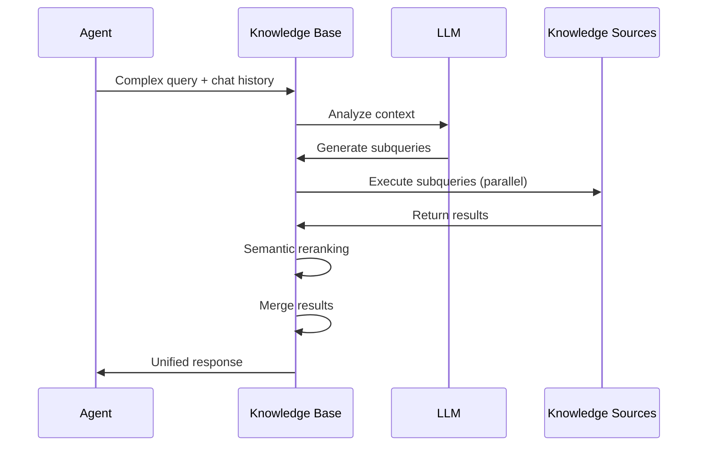
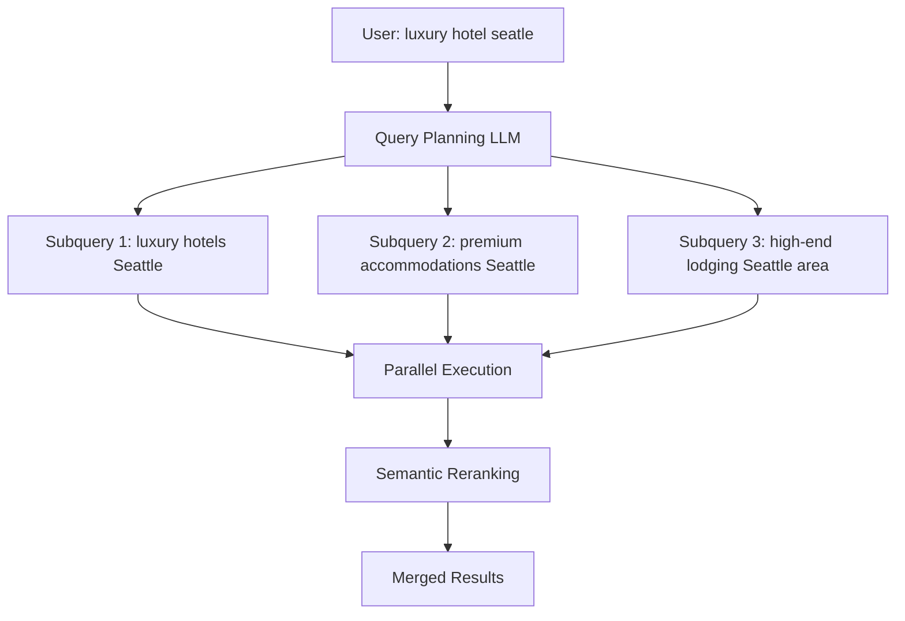
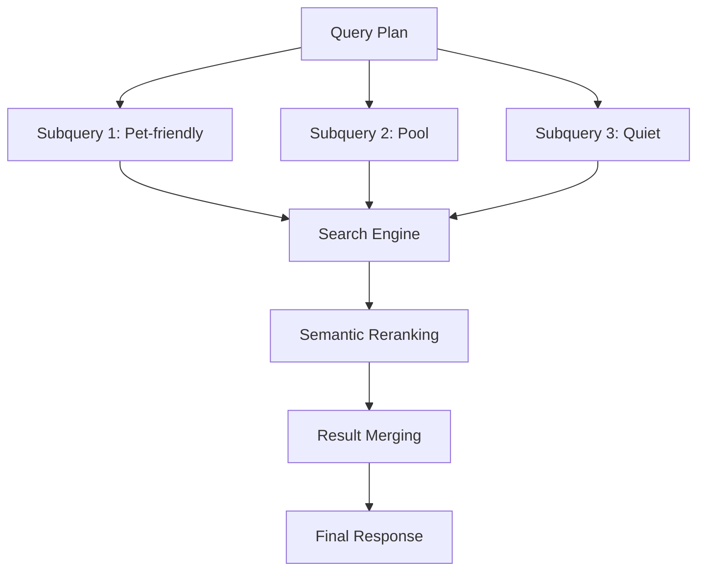

# Agentic Retrieval in Azure AI Search

<Note>
  Agentic retrieval is currently in **public preview**. Features and capabilities may change.
</Note>

Agentic retrieval is a multi-query pipeline designed for complex questions posed by users or agents in chat and copilot applications. It's optimized for Retrieval Augmented Generation (RAG) patterns and agent-to-agent workflows.

## What is Agentic Retrieval?

Agentic retrieval transforms how AI agents interact with your data by:

- **Query decomposition**: Using an LLM to break down complex queries into focused subqueries
- **Parallel execution**: Running multiple subqueries simultaneously for better coverage
- **Semantic reranking**: Promoting the most relevant matches from each subquery
- **Unified response**: Combining results into a modular, comprehensive answer

## Key Capabilities

<CardGroup cols={2}>
  <Card title="LLM Query Planning" icon="brain">
    Automatically breaks complex questions into targeted subqueries using chat history and context
  </Card>
  
  <Card title="Parallel Retrieval" icon="bolt">
    Executes multiple searches simultaneously across indexed and remote knowledge sources
  </Card>
  
  <Card title="Semantic Reranking" icon="ranking-star">
    Applies machine learning to surface the most relevant results for each subquery
  </Card>
  
  <Card title="Agent-Optimized Response" icon="robot">
    Returns structured output designed for agent consumption with grounding data and references
  </Card>
</CardGroup>

## How It Works



### Retrieval Process

<Steps>
  <Step title="Workflow Initiation">
    Application calls a knowledge base with a query and conversation history
  </Step>
  
  <Step title="Query Planning">
    Knowledge base sends query and history to an LLM, which analyzes context and breaks down the question into focused subqueries
  </Step>
  
  <Step title="Query Execution">
    Knowledge base sends subqueries to knowledge sources. All execute simultaneously using keyword, vector, or hybrid search
  </Step>
  
  <Step title="Semantic Reranking">
    Each subquery's results undergo semantic reranking to identify the most relevant matches
  </Step>
  
  <Step title="Result Synthesis">
    System combines all results into a three-part response: merged content, source references, and execution details
  </Step>
</Steps>

## Why Use Agentic Retrieval?

### Complex Query Handling

Traditional search struggles with queries like:
- "Find me a hotel near the beach, with airport transportation, and that's within walking distance of vegetarian restaurants"

Agentic retrieval decomposes this into:
1. Hotels near beaches
2. Hotels with airport shuttle service
3. Hotels near vegetarian dining options

### Query Expansion



**Benefits:**
- Corrects spelling mistakes automatically
- Adds synonyms and paraphrasing
- Includes chat history context
- Handles compound questions

### Multi-Source Retrieval

Query across different knowledge sources simultaneously:
- Indexed search indexes
- Remote SharePoint sites
- Public web data (Bing)
- Microsoft OneLake
- Azure Blob Storage

## Architecture Components

### Knowledge Base

Orchestrates the entire retrieval pipeline:

```json
{
  "name": "my-knowledge-base",
  "description": "Customer support knowledge base",
  "knowledgeSources": [
    {"name": "product-docs"},
    {"name": "support-articles"},
    {"name": "sharepoint-kb"}
  ],
  "llmConnection": {
    "resourceId": "/subscriptions/.../openai",
    "deploymentName": "gpt-4o"
  },
  "semanticConfiguration": "my-semantic-config"
}
```

### Knowledge Sources

Represent searchable content:

- **Indexed sources**: Search indexes on Azure AI Search
- **Remote sources**: Live data from SharePoint, Bing, or web APIs

```json
{
  "name": "product-docs",
  "type": "searchIndex",
  "indexName": "products-index",
  "description": "Product documentation and specifications"
}
```

### Required Components

| Component | Service | Purpose |
|-----------|---------|----------|
| **LLM** | Azure OpenAI | Query planning and context analysis |
| **Knowledge Base** | Azure AI Search | Orchestration and parameter management |
| **Knowledge Source** | Azure AI Search | Wrapper for search indexes or remote data |
| **Search Index** | Azure AI Search | Stores searchable text and vectors |
| **Semantic Ranker** | Azure AI Search | L2 reranking for relevance |

## Response Structure

Agentic retrieval returns a three-part response:

### 1. Merged Content

Grounding data for LLM answer generation:

```json
{
  "content": "Based on the search results...\n\nProduct A features...\n\nProduct B offers...",
  "references": [
    {
      "id": "ref1",
      "title": "Product A Documentation",
      "url": "https://..."
    }
  ]
}
```

### 2. Source References

Original documents for citation:

```json
{
  "references": [
    {
      "referenceId": "ref1",
      "documentId": "doc123",
      "title": "Product A Documentation",
      "snippet": "Product A is designed for...",
      "score": 0.89,
      "source": "product-docs"
    }
  ]
}
```

### 3. Activity Log

Execution details for debugging:

```json
{
  "activityLog": {
    "queryPlan": {
      "originalQuery": "best product for small business",
      "subqueries": [
        "products suitable for small business",
        "affordable business solutions",
        "SMB recommended products"
      ]
    },
    "execution": [
      {
        "subquery": "products suitable for small business",
        "source": "product-docs",
        "resultsCount": 15,
        "executionTimeMs": 45
      }
    ]
  }
}
```

## Retrieval Reasoning Effort

Control LLM usage with reasoning effort levels:

<Tabs>
  <Tab title="Minimal">
    **Minimal Effort**
    
    - No LLM query planning
    - Direct keyword and vector search
    - All knowledge sources queried
    - Fastest execution
    - Lowest cost
    
    **Use when:**
    - Query is already well-formed
    - Speed is critical
    - Cost optimization is important
  </Tab>
  
  <Tab title="Low">
    **Low Effort**
    
    - Basic LLM query planning
    - Limited query expansion
    - Selective knowledge source targeting
    - Balanced performance
    
    **Use when:**
    - Moderate query complexity
    - Balance between speed and intelligence
    - Standard use cases
  </Tab>
  
  <Tab title="Medium">
    **Medium Effort**
    
    - Full LLM query planning
    - Complete query expansion
    - Context-aware subquery generation
    - Higher quality results
    
    **Use when:**
    - Complex questions
    - Chat history is important
    - Quality over speed
  </Tab>
</Tabs>

## Example: Complex Query Decomposition

### User Query
```
"I need a hotel in San Diego for next weekend that allows dogs and has a pool. 
My previous stay at the Marina Inn was too noisy."
```

### Query Plan

The LLM generates subqueries:

1. **Subquery 1**: "pet-friendly hotels San Diego"
   - Targets: Hotels allowing dogs
   - Filter: PetsAllowed eq true

2. **Subquery 2**: "hotels with swimming pool San Diego"
   - Targets: Pool amenities
   - Filter: PoolAvailable eq true

3. **Subquery 3**: "quiet hotels San Diego NOT Marina Inn"
   - Targets: Peaceful locations
   - Excludes: Previous stay
   - Context: User preference for quiet

### Execution



## Multi-Source Example

### Knowledge Base Configuration

```json
{
  "name": "enterprise-kb",
  "knowledgeSources": [
    {
      "name": "internal-docs",
      "type": "searchIndex",
      "alwaysQuery": false
    },
    {
      "name": "sharepoint-policies",
      "type": "remoteSharePoint",
      "alwaysQuery": true
    },
    {
      "name": "web-resources",
      "type": "web",
      "alwaysQuery": false
    }
  ],
  "retrievalReasoningEffort": "low"
}
```

### Query Execution

**User Query**: "What is our vacation policy and industry best practices?"

**Routing Logic**:
- `sharepoint-policies` (always queried): Company policies
- `internal-docs` (conditionally): HR documentation
- `web-resources` (conditionally): Industry standards

## Integration with Foundry Agent Service

Connect agentic retrieval to Microsoft Foundry agents:

<Steps>
  <Step title="Create Knowledge Base">
    Define knowledge base with indexed sources and vector fields
  </Step>
  
  <Step title="Connect to Foundry">
    Link knowledge base to Foundry Agent Service using connection string
  </Step>
  
  <Step title="Agent Configuration">
    Configure agent to use knowledge base for grounding
  </Step>
  
  <Step title="Query Execution">
    Agent automatically uses knowledge base for information retrieval
  </Step>
</Steps>

## Performance Considerations

### Latency Factors

Agentic retrieval adds latency due to:
- LLM query planning (1-3 seconds)
- Parallel subquery execution
- Semantic reranking

### Optimization Strategies

<AccordionGroup>
  <Accordion title="Use Faster Models">
    - `gpt-4o-mini` for query planning
    - Reduces planning latency by 50-70%
    - Sufficient for most query decomposition tasks
  </Accordion>
  
  <Accordion title="Minimize LLM Processing">
    - Set `retrievalReasoningEffort` to `minimal` when possible
    - Exclude LLM processing for simple queries
    - Use direct search for known patterns
  </Accordion>
  
  <Accordion title="Optimize Knowledge Sources">
    - Consolidate indexes to reduce fan-out
    - Use `alwaysQuery: false` for optional sources
    - Provide clear descriptions for source selection
  </Accordion>
  
  <Accordion title="Summarize Message Threads">
    - Limit chat history to recent messages
    - Summarize long conversations before processing
    - Reduces input token count
  </Accordion>
</AccordionGroup>

## Cost Estimation

### Billing Components

1. **Azure OpenAI** (query planning):
   - Input tokens: Chat history + query
   - Output tokens: Subqueries generated
   - Model-specific pricing (e.g., gpt-4o, gpt-4o-mini)

2. **Azure AI Search** (agentic retrieval):
   - Token-based: 1 million tokens per unit
   - Free tier: 50 million tokens/month
   - Pay-as-you-go after free quota

### Example Cost Calculation

**Scenario**: 2,000 agentic retrievals per month

**Assumptions**:
- 3 subqueries per retrieval
- 50 chunks reranked per subquery
- 500 tokens per chunk
- 2,000 input tokens (chat history)
- 350 output tokens (query plan)

**Azure AI Search**:
- Total queries: 2,000 × 3 = 6,000
- Total chunks: 6,000 × 50 = 300,000
- Total tokens: 300,000 × 500 = 150 million
- Cost: ~$3.30 USD

**Azure OpenAI (gpt-4o-mini)**:
- Input: 2,000 × 2,000 = 4M tokens × $0.15/1M = $0.60
- Output: 2,000 × 350 = 700K tokens × $0.60/1M = $0.42
- Cost: ~$1.02 USD

**Total**: ~$4.32 USD for 2,000 retrievals

## Availability and Pricing

Agentic retrieval is available in selected regions during preview.

### Supported Regions

Check [region support documentation](https://learn.microsoft.com/azure/search/search-region-support) for current availability.

### Pricing Plans

| Plan | Description | Monthly Quota |
|------|-------------|---------------|
| **Free** | Default on all tiers | 50M tokens |
| **Standard** | Pay-as-you-go after free quota | Unlimited |

<Note>
  You are not notified when transitioning from free to paid quota. Monitor usage through Azure portal metrics.
</Note>

## When to Use Agentic Retrieval

Agentic retrieval is ideal for:

<CardGroup cols={2}>
  <Card title="Complex Questions" icon="comments-question">
    Multi-part questions requiring decomposition and parallel search
  </Card>
  
  <Card title="Agent Workflows" icon="diagram-project">
    Agent-to-agent communication needing structured responses
  </Card>
  
  <Card title="RAG Applications" icon="message-bot">
    Chat applications requiring high-quality grounding data
  </Card>
  
  <Card title="Multi-Source Scenarios" icon="database">
    Querying across indexed and remote data sources
  </Card>
</CardGroup>

## Next Steps

<CardGroup cols={2}>
  <Card title="Create Knowledge Base" icon="plus" href="/search/agentic/create-knowledge-base">
    Set up your first knowledge base
  </Card>
  
  <Card title="Knowledge Sources" icon="folder-tree" href="/search/agentic/knowledge-sources">
    Learn about different knowledge source types
  </Card>
  
  <Card title="Create Index" icon="list" href="/search/agentic/create-index">
    Build an index for agentic retrieval
  </Card>
  
  <Card title="Query API" icon="code" href="https://learn.microsoft.com/rest/api/searchservice/knowledge-retrieval">
    Explore the retrieval API reference
  </Card>
</CardGroup>
