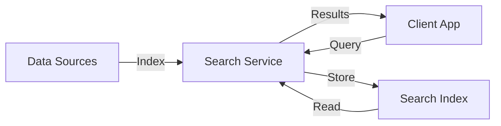
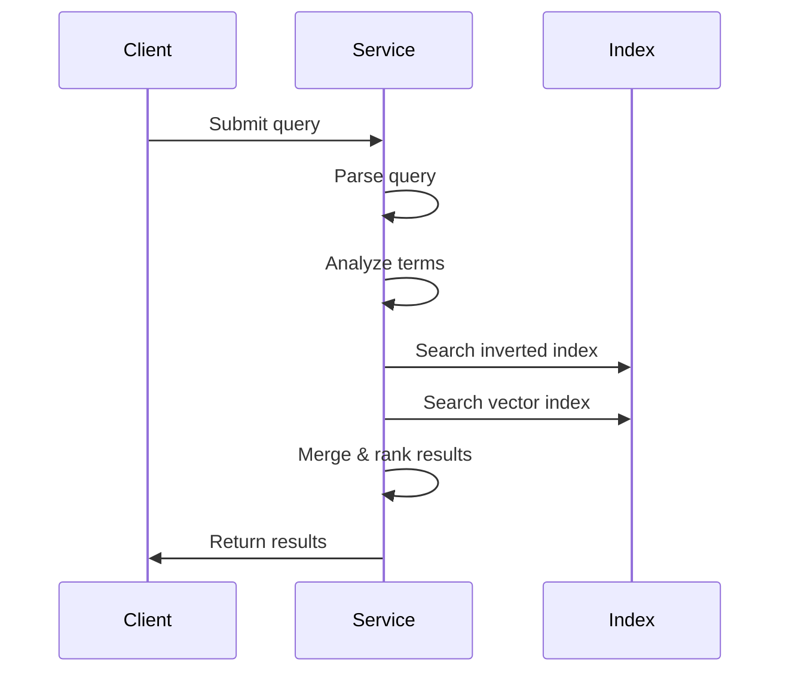

# Classic Search in Azure AI Search

Classic search is an index-first retrieval model for predictable, low-latency queries. Each query targets a single, predefined search index and returns ranked documents in one request-response cycle.

## What is Classic Search?

Classic search provides the traditional search engine experience where:

- Queries execute against a single index
- Results return in one request-response cycle
- No LLM-assisted planning or iteration occurs
- Ranking is based on BM25 or similarity metrics

In this architecture, your search service sits between data stores containing your content and your client application.

## Architecture



## Primary Workloads

Classic search has two primary workloads:

### Indexing

**Indexing** loads content into an index and makes it searchable:

- Inbound text is tokenized and stored in inverted indexes
- Inbound vectors are stored in vector indexes
- Content must be in JSON format
- Use push method (upload JSON) or pull method (indexers)

**Indexing Process:**

1. **Document cracking**: Extract text and metadata from source documents
2. **Field mapping**: Map source fields to index fields
3. **AI enrichment** (optional): Apply skills for OCR, entity extraction, vectorization
4. **Tokenization**: Break text into terms for full-text search
5. **Storage**: Store in inverted indexes (text) and vector indexes (embeddings)

### Querying

**Querying** targets an index populated with searchable content:

- Client app sends query request to search service
- Set up search client to handle various query types
- Query executes against indexed content
- Results ranked by relevance score

**Query Types Supported:**

- **Full-text search**: Keyword-based queries with BM25 ranking
- **Vector search**: Similarity search using embeddings
- **Hybrid search**: Combined text and vector queries
- **Multimodal search**: Query across text and images
- **Fuzzy search**: Handle typos and misspellings
- **Autocomplete**: Type-ahead suggestions
- **Geo-spatial search**: Location-based filtering

## Key Characteristics

<CardGroup cols={2}>
  <Card title="Single Index" icon="database">
    Each query targets exactly one search index
  </Card>
  
  <Card title="Synchronous" icon="bolt">
    One request, one response cycle
  </Card>
  
  <Card title="Deterministic" icon="chart-line">
    Same query returns consistent results
  </Card>
  
  <Card title="Low Latency" icon="clock">
    Predictable response times (milliseconds)
  </Card>
</CardGroup>

## Search Index

A search index is the central concept in classic search:

### Index Schema

```json
{
  "name": "hotels-index",
  "fields": [
    {
      "name": "hotelId",
      "type": "Edm.String",
      "key": true,
      "searchable": false
    },
    {
      "name": "hotelName",
      "type": "Edm.String",
      "searchable": true,
      "filterable": true,
      "sortable": true
    },
    {
      "name": "description",
      "type": "Edm.String",
      "searchable": true,
      "analyzer": "en.microsoft"
    },
    {
      "name": "descriptionVector",
      "type": "Collection(Edm.Single)",
      "searchable": true,
      "dimensions": 1536,
      "vectorSearchProfile": "my-vector-profile"
    },
    {
      "name": "rating",
      "type": "Edm.Double",
      "filterable": true,
      "sortable": true,
      "facetable": true
    }
  ]
}
```

### Index Features

- **Document key**: Unique identifier (required)
- **Searchable fields**: Full-text or vector searchable
- **Filterable fields**: Used in filter expressions
- **Sortable fields**: Can order results
- **Facetable fields**: Generate counts by category
- **Retrievable fields**: Returned in search results

## Query Execution

### Query Flow



### Query Example

```json
{
  "search": "luxury hotel with ocean view",
  "searchFields": "hotelName,description",
  "select": "hotelId,hotelName,description,rating",
  "filter": "rating ge 4.5",
  "orderby": "rating desc",
  "top": 10,
  "skip": 0,
  "count": true
}
```

**Query Parameters:**

- `search`: Query string for full-text search
- `searchFields`: Fields to search (optional)
- `select`: Fields to return in results
- `filter`: OData filter expression
- `orderby`: Sort expression
- `top`: Maximum results to return
- `skip`: Number of results to skip (pagination)
- `count`: Include total count of matches

## Full-Text Search

Full-text search in classic mode uses:

### BM25 Ranking

The default relevance algorithm:
- **Term frequency (TF)**: How often term appears in document
- **Inverse document frequency (IDF)**: Rarity of term across all documents
- **Field length normalization**: Shorter fields weighted higher

### Text Analysis

Text undergoes lexical analysis:

1. **Tokenization**: Break text into terms
2. **Lowercasing**: Normalize case
3. **Stop word removal**: Remove common words ("the", "and")
4. **Stemming**: Reduce to root form ("running" → "run")

### Analyzers

- **Standard analyzer**: Default, language-agnostic
- **Language analyzers**: 56 languages supported (Microsoft and Lucene)
- **Custom analyzers**: Define your own tokenization rules

## Vector Search

Vector search finds semantically similar content:

### How It Works

1. Generate embeddings from text or images
2. Store embeddings in vector fields
3. Query with embedding of search query
4. Find nearest neighbors using similarity metric

### Similarity Metrics

- **Cosine similarity**: Default for Azure OpenAI embeddings
- **Euclidean distance**: Geometric distance
- **Dot product**: Inner product similarity

### Vector Configuration

```json
{
  "vectorSearch": {
    "algorithms": [
      {
        "name": "my-hnsw-config",
        "kind": "hnsw",
        "hnswParameters": {
          "m": 4,
          "efConstruction": 400,
          "efSearch": 500,
          "metric": "cosine"
        }
      }
    ],
    "profiles": [
      {
        "name": "my-vector-profile",
        "algorithm": "my-hnsw-config"
      }
    ]
  }
}
```

## Hybrid Search

Combine full-text and vector search in one request:

```json
{
  "search": "luxury beachfront hotel",
  "vectorQueries": [
    {
      "kind": "vector",
      "vector": [0.01, 0.02, ...],
      "fields": "descriptionVector",
      "k": 50
    }
  ],
  "select": "hotelName,description,rating",
  "top": 10
}
```

**Benefits:**
- Best of both worlds: precision (keyword) + recall (semantic)
- Results merged using Reciprocal Rank Fusion (RRF)
- Improved relevance over either method alone

## Filters and Facets

### Filters

Narrow results using OData syntax:

```
filter=rating ge 4.5 and category eq 'Luxury'
filter=geo.distance(location, geography'POINT(-122.12 47.67)') le 10
filter=tags/any(t: t eq 'pet-friendly')
```

### Facets

Generate counts by category:

```json
{
  "search": "hotel",
  "facets": ["category", "rating,interval:1"]
}
```

**Response:**
```json
{
  "@search.facets": {
    "category": [
      {"value": "Luxury", "count": 42},
      {"value": "Budget", "count": 38}
    ],
    "rating": [
      {"value": 4, "count": 15},
      {"value": 5, "count": 27}
    ]
  }
}
```

## Relevance Tuning

### Scoring Profiles

Boost specific fields or values:

```json
{
  "scoringProfiles": [
    {
      "name": "boost-recent",
      "functions": [
        {
          "type": "freshness",
          "fieldName": "lastRenovationDate",
          "boost": 2.0,
          "interpolation": "linear",
          "freshness": {
            "boostingDuration": "P365D"
          }
        }
      ]
    }
  ]
}
```

### Semantic Ranking

Apply machine learning for better relevance:

```json
{
  "search": "pet friendly hotel with parking",
  "queryType": "semantic",
  "semanticConfiguration": "my-semantic-config",
  "queryLanguage": "en-us"
}
```

## When to Use Classic Search

Classic search is ideal for:

<AccordionGroup>
  <Accordion title="Traditional Search Applications">
    - Website search boxes
    - E-commerce product search
    - Document management systems
    - Knowledge base search
  </Accordion>
  
  <Accordion title="Predictable Performance Requirements">
    - Need consistent, low-latency responses
    - Service-level agreements (SLAs) on query time
    - High query volumes
  </Accordion>
  
  <Accordion title="Cost-Sensitive Scenarios">
    - No LLM costs
    - Lower complexity than agentic retrieval
    - Predictable pricing model
  </Accordion>
  
  <Accordion title="Simple Retrieval Needs">
    - Single-index queries
    - Deterministic results required
    - No need for query planning or iteration
  </Accordion>
</AccordionGroup>

## Performance Optimization

<CardGroup cols={2}>
  <Card title="Index Design" icon="pen-ruler">
    Mark fields as searchable, filterable, or sortable only when needed
  </Card>
  
  <Card title="Query Optimization" icon="gauge-high">
    Use filters to reduce search scope before full-text search
  </Card>
  
  <Card title="Caching" icon="server">
    Cache frequently used queries at application level
  </Card>
  
  <Card title="Replica Scaling" icon="clone">
    Add replicas to handle higher query loads
  </Card>
</CardGroup>

## Comparison with Agentic Retrieval

| Feature | Classic Search | Agentic Retrieval |
|---------|---------------|------------------|
| Query target | Single index | Multiple knowledge sources |
| Query planning | None | LLM-assisted |
| Execution | Single request | Parallel subqueries |
| Response | Document list | Structured answer + references |
| Latency | Low (ms) | Higher (seconds) |
| Cost | Lower | Higher (LLM costs) |
| Use case | Traditional search | Agent workflows, complex Q&A |

## Next Steps

<CardGroup cols={2}>
  <Card title="Create an Index" icon="plus" href="/search/indexing/overview">
    Build your first search index
  </Card>
  
  <Card title="Query Syntax" icon="code" href="/search/queries/full-text">
    Learn full-text query syntax
  </Card>
  
  <Card title="Vector Search" icon="diagram-project" href="/search/concepts/vector-search">
    Add semantic search capabilities
  </Card>
  
  <Card title="Hybrid Search" icon="magnifying-glass" href="/search/concepts/hybrid-search">
    Combine text and vector search
  </Card>
</CardGroup>
