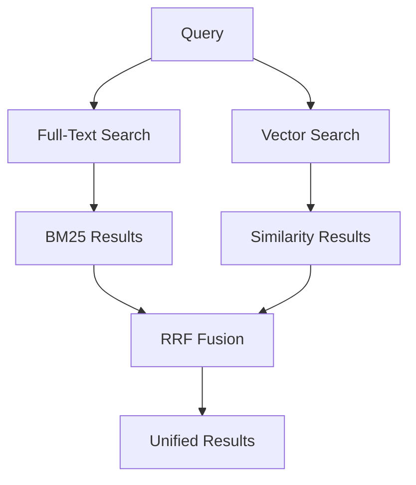

# Hybrid Search in Azure AI Search

Hybrid search combines the strengths of vector search and keyword search in a single query request, providing better results than either method alone.

## What is Hybrid Search?

Hybrid search executes both full-text and vector queries simultaneously, then merges results using Reciprocal Rank Fusion (RRF).

<CardGroup cols={2}>
  <Card title="Vector Search" icon="diagram-project">
    Finds semantically similar content regardless of exact keywords
  </Card>
  
  <Card title="Keyword Search" icon="magnifying-glass">
    Finds exact matches with precision on names, codes, dates
  </Card>
</CardGroup>

## Why Use Hybrid Search?

### Complementary Strengths

- **Vector search**: High recall, semantic understanding
- **Keyword search**: High precision, exact matches
- **Combined**: Best of both worlds

### Benchmark Results

Hybrid search with semantic ranker offers significant improvements in search relevance over either method alone.

## How Hybrid Search Works



### Query Execution

1. **Parallel execution**: Full-text and vector queries run simultaneously
2. **Independent ranking**: Each query uses its own ranking algorithm
3. **Result fusion**: RRF merges and reranks all results
4. **Single response**: Unified result set returned to client

## Hybrid Query Structure

```json
{
  "count": true,
  "search": "luxury beachfront hotel",
  "select": "hotelName, description, rating",
  "filter": "rating ge 4.5",
  "vectorQueries": [
    {
      "kind": "vector",
      "vector": [-0.009, 0.018, ...],
      "fields": "descriptionVector",
      "k": 50
    }
  ],
  "top": 10
}
```

**Key components**:
- `search`: Full-text query string
- `vectorQueries`: One or more vector queries
- `filter`: Apply to both queries
- `top`: Final result count after fusion

## Reciprocal Rank Fusion (RRF)

RRF combines multiple result sets by:

```
RRF_score(d) = Σ 1 / (k + rank_i(d))
```

Where:
- `d` = document
- `k` = constant (typically 60)
- `rank_i(d)` = rank of document in result set i

### Example Fusion

**Text results**:
1. Doc A (score: 10.5)
2. Doc B (score: 8.2)
3. Doc C (score: 6.1)

**Vector results**:
1. Doc C (score: 0.89)
2. Doc A (score: 0.85)
3. Doc D (score: 0.82)

**RRF scores**:
- Doc A: 1/61 + 1/61 = 0.0328
- Doc C: 1/63 + 1/61 = 0.0323
- Doc B: 1/62 + 0 = 0.0161
- Doc D: 0 + 1/63 = 0.0159

**Final ranking**: A, C, B, D

## With Semantic Ranking

Add semantic ranking for even better results:

```json
{
  "search": "luxury hotel near beach",
  "queryType": "semantic",
  "semanticConfiguration": "my-semantic-config",
  "queryLanguage": "en-us",
  "vectorQueries": [
    {
      "kind": "vector",
      "vector": [...],
      "fields": "descriptionVector",
      "k": 50
    }
  ]
}
```

**Processing order**:
1. Execute full-text and vector queries
2. Apply filters
3. Merge with RRF
4. Semantic reranking on top 50 results
5. Return top results

## Filtering in Hybrid Search

Filters apply to both query types:

```json
{
  "search": "conference hotel",
  "filter": "meetingRooms gt 5 and parkingIncluded eq true",
  "vectorFilterMode": "postFilter",
  "vectorQueries": [
    {
      "kind": "vector",
      "vector": [...],
      "fields": "descriptionVector",
      "k": 50
    }
  ]
}
```

### Filter Modes

- `preFilter`: Apply before vector search (faster, fewer candidates)
- `postFilter`: Apply after vector search (more candidates, slower)

## Multiple Vector Queries

Search multiple vector fields:

```json
{
  "search": "thriller mystery novel",
  "vectorQueries": [
    {
      "kind": "vector",
      "vector": [...],
      "fields": "descriptionVector",
      "k": 50,
      "weight": 2.0
    },
    {
      "kind": "vector",
      "vector": [...],
      "fields": "synopsisVector",
      "k": 50,
      "weight": 1.0
    }
  ]
}
```

**Vector weighting**: Adjust relative importance of each vector query

## Use Cases

<AccordionGroup>
  <Accordion title="Product Search">
    - Keywords: Exact product codes, SKUs
    - Vectors: Product descriptions, features
    - Result: Find by code OR similar products
  </Accordion>
  
  <Accordion title="Document Search">
    - Keywords: Author names, dates, document IDs
    - Vectors: Content similarity
    - Result: Precise metadata + semantic content
  </Accordion>
  
  <Accordion title="Knowledge Base">
    - Keywords: Technical terms, acronyms
    - Vectors: Conceptual similarity
    - Result: Exact terminology + related concepts
  </Accordion>
</AccordionGroup>

## Best Practices

<CardGroup cols={2}>
  <Card title="Set k=50" icon="hashtag">
    For semantic ranker, use k=50 to provide sufficient input
  </Card>
  
  <Card title="Use Filters" icon="filter">
    Pre-filter to reduce search scope and improve performance
  </Card>
  
  <Card title="Test Weights" icon="scale-balanced">
    Experiment with vector weights to optimize for your data
  </Card>
  
  <Card title="Monitor Performance" icon="gauge">
    Track query latency and result quality metrics
  </Card>
</CardGroup>

## Next Steps

<CardGroup cols={2}>
  <Card title="Vector Search" icon="diagram-project" href="/search/concepts/vector-search">
    Learn about vector search concepts
  </Card>
  
  <Card title="Full-Text Search" icon="text" href="/search/queries/full-text">
    Master keyword query syntax
  </Card>
  
  <Card title="Semantic Ranking" icon="ranking-star" href="https://learn.microsoft.com/azure/search/semantic-search-overview">
    Add ML-based reranking
  </Card>
</CardGroup>
