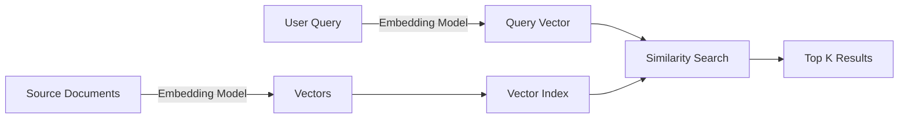

# Vector Search in Azure AI Search

Vector search is an information retrieval approach that uses numeric representations of content for semantic similarity matching. Unlike keyword search, vector search finds conceptually similar content even without exact text matches.

## What is Vector Search?

Vector search enables matching based on:

- **Semantic similarity**: "dog" and "canine" are conceptually similar but linguistically distinct
- **Multilingual content**: "dog" in English and "hund" in German
- **Multimodal content**: Text descriptions and images of dogs

## Key Concepts

<CardGroup cols={2}>
  <Card title="Embeddings" icon="vector-square">
    Numeric representations of content generated by machine learning models
  </Card>
  
  <Card title="Vector Space" icon="cube">
    Multi-dimensional space where semantically similar items are close together
  </Card>
  
  <Card title="Similarity Metrics" icon="ruler">
    Mathematical functions to measure distance between vectors (cosine, euclidean)
  </Card>
  
  <Card title="Nearest Neighbors" icon="location-dot">
    Algorithm to find the k most similar vectors to a query vector
  </Card>
</CardGroup>

## How Vector Search Works



### Indexing Flow

1. **Generate embeddings**: Use embedding models (Azure OpenAI, etc.) to convert text/images to vectors
2. **Create vector index**: Store vectors in search index with HNSW or exhaustive KNN algorithm
3. **Store metadata**: Keep human-readable fields alongside vectors

### Query Flow

1. **Vectorize query**: Convert search query to vector using same embedding model
2. **Similarity search**: Find nearest neighbors in vector space
3. **Return results**: Retrieve top k most similar documents

## Embedding Models

### Azure OpenAI

```json
{
  "input": "what azure services support generative AI",
  "model": "text-embedding-ada-002"
}
```

**Response**: 1,536-dimension vector

### Popular Models

| Model | Dimensions | Use Case |
|-------|-----------|----------|
| text-embedding-ada-002 | 1536 | General purpose text |
| text-embedding-3-small | 512-1536 | Efficient text embedding |
| text-embedding-3-large | 256-3072 | High quality text embedding |
| CLIP | 512 | Multimodal (text + images) |

## Vector Index Configuration

### HNSW Algorithm

```json
{
  "vectorSearch": {
    "algorithms": [
      {
        "name": "my-hnsw-config",
        "kind": "hnsw",
        "hnswParameters": {
          "m": 4,
          "efConstruction": 400,
          "efSearch": 500,
          "metric": "cosine"
        }
      }
    ],
    "profiles": [
      {
        "name": "my-vector-profile",
        "algorithm": "my-hnsw-config"
      }
    ]
  }
}
```

**Parameters**:
- `m`: Bi-directional link count (4-10)
- `efConstruction`: Neighbors during indexing (100-1000)
- `efSearch`: Neighbors during search (100-1000)
- `metric`: Similarity function (cosine, euclidean, dotProduct)

### Exhaustive KNN

```json
{
  "algorithms": [
    {
      "name": "my-eknn-config",
      "kind": "exhaustiveKnn",
      "exhaustiveKnnParameters": {
        "metric": "cosine"
      }
    }
  ]
}
```

**Use when**:
- Maximum accuracy required
- Small dataset (< 1M vectors)
- Accuracy more important than speed

## Vector Query Example

```json
{
  "vectorQueries": [
    {
      "kind": "vector",
      "vector": [
        -0.009154141,
        0.018708462,
        // ... 1536 dimensions
        -0.00086512347
      ],
      "fields": "contentVector",
      "k": 50
    }
  ],
  "select": "title, content, category"
}
```

**Parameters**:
- `vector`: Query embedding (must match field dimensions)
- `fields`: Vector field(s) to search
- `k`: Number of nearest neighbors to return

## Compression and Optimization

### Scalar Quantization

Reduce vector size by compressing float values:

```json
{
  "compressions": [
    {
      "name": "scalar-quantization",
      "kind": "scalarQuantization",
      "scalarQuantizationParameters": {
        "quantizedDataType": "int8"
      },
      "rescoringOptions": {
        "enableRescoring": true,
        "defaultOversampling": 10
      }
    }
  ]
}
```

**Benefits**:
- 75% size reduction
- Faster search
- Lower storage costs
- Minimal accuracy loss with rescoring

### Binary Quantization

Compress to 1-bit values:

```json
{
  "compressions": [
    {
      "name": "binary-quantization",
      "kind": "binaryQuantization",
      "rescoringOptions": {
        "enableRescoring": true,
        "defaultOversampling": 20
      }
    }
  ]
}
```

**Benefits**:
- 96% size reduction
- Fastest search
- Lowest storage costs
- Higher accuracy loss (mitigated by rescoring)

## Similarity Metrics

### Cosine Similarity

Measures angle between vectors (default for Azure OpenAI):

```
similarity = (A · B) / (||A|| ||B||)
```

**Range**: -1 to 1 (higher is more similar)

### Euclidean Distance

Measures straight-line distance:

```
distance = sqrt(Σ(Ai - Bi)²)
```

**Range**: 0 to ∞ (lower is more similar)

### Dot Product

Measures vector alignment and magnitude:

```
similarity = Σ(Ai × Bi)
```

**Range**: -∞ to ∞ (higher is more similar)

## Integrated Vectorization

Automate embedding generation during indexing:

```json
{
  "fields": [
    {
      "name": "contentVector",
      "type": "Collection(Edm.Single)",
      "searchable": true,
      "dimensions": 1536,
      "vectorSearchProfile": "my-vector-profile"
    }
  ],
  "vectorizers": [
    {
      "name": "my-openai-vectorizer",
      "kind": "azureOpenAI",
      "azureOpenAIParameters": {
        "resourceUri": "https://my-openai.openai.azure.com",
        "deploymentId": "text-embedding-ada-002",
        "apiKey": "..."
      }
    }
  ]
}
```

### Query-Time Vectorization

```json
{
  "vectorQueries": [
    {
      "kind": "text",
      "text": "luxury hotel with ocean view",
      "fields": "descriptionVector",
      "k": 50
    }
  ]
}
```

**Benefits**:
- No manual embedding generation
- Consistent model usage
- Simplified implementation

## Use Cases

<AccordionGroup>
  <Accordion title="Semantic Search">
    Find conceptually similar content regardless of exact keywords:
    - "affordable car" matches "inexpensive vehicle"
    - "laptop repair" matches "computer maintenance"
  </Accordion>
  
  <Accordion title="Multilingual Search">
    Search across languages without translation:
    - English query finds German documents
    - Single vector space for all languages
  </Accordion>
  
  <Accordion title="Multimodal Search">
    Query images with text or text with images:
    - "red sports car" finds car images
    - Image query finds similar product photos
  </Accordion>
  
  <Accordion title="Recommendation Systems">
    Find similar items based on embeddings:
    - "Customers who liked this also viewed..."
    - Content-based filtering
  </Accordion>
</AccordionGroup>

## Performance Considerations

### Index Size

- Vectors require significant storage
- 1M documents × 1536 dimensions × 4 bytes = 6 GB
- Use compression to reduce by 75-96%

### Query Performance

- HNSW: Approximate, fast (ms)
- Exhaustive KNN: Exact, slower (seconds for large datasets)
- Compression: Faster but requires rescoring

### Best Practices

<CardGroup cols={2}>
  <Card title="Right-Size k" icon="hashtag">
    Request only needed results (typically 10-50)
  </Card>
  
  <Card title="Use Compression" icon="compress">
    Enable quantization for large indexes
  </Card>
  
  <Card title="Tune HNSW" icon="sliders">
    Adjust parameters for accuracy vs speed trade-off
  </Card>
  
  <Card title="Monitor Metrics" icon="chart-line">
    Track query latency and accuracy
  </Card>
</CardGroup>

## Next Steps

<CardGroup cols={2}>
  <Card title="Create Vector Index" icon="plus" href="/search/agentic/create-index">
    Build your first vector search index
  </Card>
  
  <Card title="Hybrid Search" icon="magnifying-glass" href="/search/concepts/hybrid-search">
    Combine vector and keyword search
  </Card>
  
  <Card title="Generate Embeddings" icon="wand-magic-sparkles" href="https://learn.microsoft.com/azure/search/vector-search-how-to-generate-embeddings">
    Learn to create embeddings
  </Card>
  
  <Card title="Query Vectors" icon="code" href="/search/queries/vector">
    Execute vector queries
  </Card>
</CardGroup>
