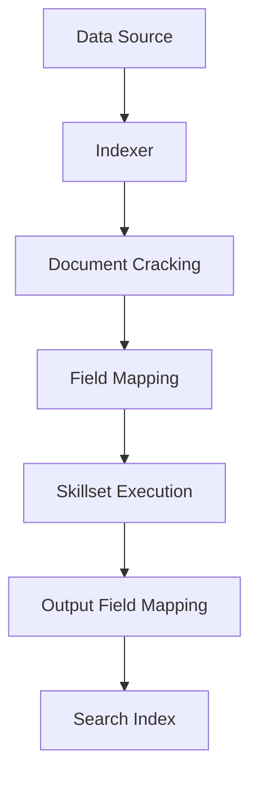

# Indexers in Azure AI Search

Indexers are crawlers that extract searchable data from supported Azure data sources and populate search indexes automatically.

## What are Indexers?

Indexers provide:

- **Automated ingestion**: Pull data from supported sources
- **Field mapping**: Map source fields to index fields
- **Change detection**: Incremental updates
- **Scheduling**: Periodic refresh (as frequent as every 5 minutes)
- **AI enrichment**: Apply skillsets for transformation

## Supported Data Sources

<CardGroup cols={2}>
  <Card title="Azure Blob Storage" icon="file">
    Index documents from blob containers
  </Card>
  
  <Card title="Azure Cosmos DB" icon="database">
    Index from NoSQL, MongoDB, Gremlin
  </Card>
  
  <Card title="Azure SQL" icon="table">
    Index from SQL Database and Managed Instance
  </Card>
  
  <Card title="SharePoint Online" icon="sharepoint">
    Index documents and sites (preview)
  </Card>
  
  <Card title="OneLake" icon="lake">
    Index from Microsoft Fabric lakehouses
  </Card>
  
  <Card title="Azure Table Storage" icon="table-cells">
    Index from Table Storage
  </Card>
</CardGroup>

## Indexer Workflow



### Stages

1. **Document cracking**: Open files and extract content
2. **Field mapping**: Map source to destination fields
3. **Skillset execution**: Apply AI skills (optional)
4. **Output field mapping**: Map skill outputs to index fields

## Create an Indexer

### 1. Create Data Source

```json
{
  "name": "my-blob-datasource",
  "type": "azureblob",
  "credentials": {
    "connectionString": "DefaultEndpointsProtocol=https;..."
  },
  "container": {
    "name": "documents"
  }
}
```

### 2. Create Indexer

```json
{
  "name": "my-indexer",
  "dataSourceName": "my-blob-datasource",
  "targetIndexName": "my-index",
  "schedule": {
    "interval": "PT2H"
  },
  "parameters": {
    "maxFailedItems": 10,
    "maxFailedItemsPerBatch": 5
  }
}
```

## Scheduling

Run indexers on a schedule:

```json
{
  "schedule": {
    "interval": "PT2H",
    "startTime": "2024-01-01T00:00:00Z"
  }
}
```

**Intervals**:
- Minimum: PT5M (5 minutes)
- Maximum: P1D (1 day)
- Format: ISO 8601 duration

## Field Mappings

Map source fields to index fields:

```json
{
  "fieldMappings": [
    {
      "sourceFieldName": "metadata_storage_path",
      "targetFieldName": "id",
      "mappingFunction": {
        "name": "base64Encode"
      }
    }
  ]
}
```

**Mapping functions**:
- `base64Encode`/`base64Decode`
- `extractTokenAtPosition`
- `jsonArrayToStringCollection`
- `urlEncode`/`urlDecode`

## AI Enrichment with Skillsets

Apply AI transformations during indexing:

```json
{
  "skills": [
    {
      "@odata.type": "#Microsoft.Skills.Text.SplitSkill",
      "textSplitMode": "pages",
      "maximumPageLength": 4000,
      "inputs": [
        {
          "name": "text",
          "source": "/document/content"
        }
      ],
      "outputs": [
        {
          "name": "textItems",
          "targetName": "chunks"
        }
      ]
    },
    {
      "@odata.type": "#Microsoft.Skills.Text.AzureOpenAIEmbeddingSkill",
      "deploymentId": "text-embedding-ada-002",
      "inputs": [
        {
          "name": "text",
          "source": "/document/chunks/*"
        }
      ],
      "outputs": [
        {
          "name": "embedding",
          "targetName": "vector"
        }
      ]
    }
  ]
}
```

## Monitoring

Track indexer execution:

- **Status**: Success, Failed, InProgress
- **Execution history**: Past runs and outcomes
- **Error details**: Failed document information
- **Metrics**: Documents processed, latency

## Change Detection

Indexers detect and process only changed documents:

- **Azure SQL**: High water mark change detection
- **Cosmos DB**: `_ts` timestamp
- **Blob Storage**: Last modified date

## Best Practices

<AccordionGroup>
  <Accordion title="Batch Size">
    Adjust batch size based on document complexity and size
  </Accordion>
  
  <Accordion title="Error Handling">
    Configure `maxFailedItems` and `maxFailedItemsPerBatch` tolerances
  </Accordion>
  
  <Accordion title="Scheduling">
    Balance freshness needs with resource utilization
  </Accordion>
  
  <Accordion title="Monitoring">
    Set up alerts for indexer failures
  </Accordion>
</AccordionGroup>

## Next Steps

<CardGroup cols={2}>
  <Card title="Skillsets" icon="wand-magic-sparkles" href="https://learn.microsoft.com/azure/search/cognitive-search-defining-skillset">
    Add AI enrichment
  </Card>
  
  <Card title="Blob Indexing" icon="file" href="https://learn.microsoft.com/azure/search/search-howto-indexing-azure-blob-storage">
    Index from blob storage
  </Card>
</CardGroup>
