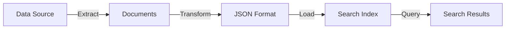

# Data Import and Indexing

Populate your search index using push or pull methods to make content searchable.

## Indexing Methods

<Tabs>
  <Tab title="Push API">
    **Push Method**
    
    Programmatically upload JSON documents:
    - No restrictions on data source type
    - Real-time updates
    - Full control over connectivity
    - Batch up to 1000 documents or 16 MB
    
    ```json
    POST /indexes/my-index/docs/index
    {
      "value": [
        {
          "@search.action": "upload",
          "id": "1",
          "title": "Azure Search",
          "content": "..."
        }
      ]
    }
    ```
  </Tab>
  
  <Tab title="Pull Method (Indexers)">
    **Pull Method (Indexers)**
    
    Automatically crawl and index data:
    - Supported data sources only
    - Scheduled refresh
    - Change detection
    - AI enrichment support
    
    **Supported sources**:
    - Azure Blob Storage
    - Azure Cosmos DB
    - Azure SQL Database
    - SharePoint Online
    - OneLake
  </Tab>
</Tabs>

## Document Actions

- **upload**: Insert new or replace existing documents
- **merge**: Update existing document fields
- **mergeOrUpload**: Merge if exists, otherwise upload
- **delete**: Remove document from index

## Indexing Workflow



## AI Enrichment

Add AI-powered transformations during indexing:

- **Data chunking**: Split large documents
- **Vectorization**: Generate embeddings
- **OCR**: Extract text from images
- **Entity recognition**: Identify people, places, organizations
- **Key phrase extraction**: Extract important terms
- **Language detection**: Identify document language

## Best Practices

<CardGroup cols={2}>
  <Card title="Batch Documents" icon="layer-group">
    Upload multiple documents per request for efficiency
  </Card>
  
  <Card title="Handle Errors" icon="triangle-exclamation">
    Implement retry logic for failed documents
  </Card>
  
  <Card title="Use Indexers" icon="gears">
    Automate ingestion from supported sources
  </Card>
  
  <Card title="Monitor Progress" icon="chart-line">
    Track indexer status and document counts
  </Card>
</CardGroup>

## Next Steps

<CardGroup cols={2}>
  <Card title="Indexers" icon="robot" href="/search/indexing/indexers">
    Learn about automated indexing
  </Card>
  
  <Card title="Create Index" icon="plus" href="https://learn.microsoft.com/azure/search/search-how-to-create-search-index">
    Build your index schema
  </Card>
</CardGroup>
