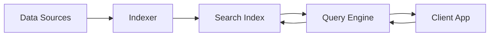
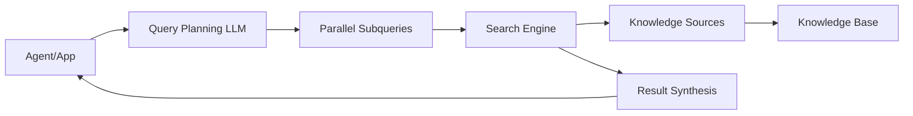

# Azure AI Search Overview

Azure AI Search is a fully managed, cloud-hosted service that connects your data to AI. The service unifies access to enterprise and web content so agents and LLMs can use context, chat history, and multi-source signals to produce reliable, grounded answers.

## What is Azure AI Search?

Azure AI Search is an AI-powered information retrieval platform that helps developers build rich search experiences and generative AI apps that combine large language models (LLMs) with enterprise or web data.

Common use cases include **classic search** and modern retrieval-augmented generation (RAG) via **agentic retrieval**. This makes Azure AI Search suitable for both enterprise and consumer scenarios, whether you're adding search functionality to a website, app, agent, or chatbot.

## Key Capabilities

When you create a search service, you unlock the following capabilities:

### Two Search Engines

- **Classic search**: Single requests for predictable, low-latency queries
- **Agentic retrieval**: Parallel, iterative, LLM-assisted search for complex agent-to-agent workflows

### Query Types

- **Full-text search**: Traditional keyword-based search with BM25 relevance ranking
- **Vector search**: Semantic similarity search using embeddings
- **Hybrid search**: Combined full-text and vector search for optimal results
- **Multimodal search**: Query across text and images in a single pipeline

### AI Enrichment

- Chunk, vectorize, and transform raw content to make it searchable
- Built-in skills for OCR, entity recognition, key phrase extraction, and more
- Integrated vectorization with Azure OpenAI and Foundry Tools

### Enterprise Features

- **Security**: Azure scale, security, monitoring, and compliance
- **Access control**: Document-level permissions and role-based access
- **Integrations**: Azure OpenAI, Microsoft Foundry, Azure data platforms

## Why Use Azure AI Search?

<CardGroup cols={2}>
  <Card title="Ground AI Agents" icon="robot">
    Provide agents and chatbots with proprietary, enterprise, or web data for accurate, context-aware responses
  </Card>
  
  <Card title="Multi-Source Data" icon="database">
    Access data from Azure Blob Storage, Azure Cosmos DB, SharePoint, OneLake, and other supported data sources
  </Card>
  
  <Card title="Hybrid Search" icon="magnifying-glass">
    Combine full-text search with vector search to balance precision and recall
  </Card>
  
  <Card title="Production Ready" icon="shield-check">
    Enterprise security, access control, and compliance through Microsoft Entra and Azure Private Link
  </Card>
</CardGroup>

## Classic Search vs Agentic Retrieval

| Aspect | Classic Search | Agentic Retrieval |
|--------|---------------|------------------|
| **Search corpus** | Search index | Knowledge source |
| **Search target** | One index defined by schema | Knowledge base with multiple sources |
| **Query plan** | No plan, just a request | LLM-assisted or user-provided plan |
| **Query request** | Search documents in an index | Retrieve from knowledge sources |
| **Response** | Flattened search results | LLM-formulated answer, activity log, references |
| **Status** | Generally available | Public preview |

## Getting Started

<Steps>
  <Step title="Create a Search Service">
    Deploy an Azure AI Search service in your preferred region and choose a pricing tier
  </Step>
  
  <Step title="Choose Your Path">
    Decide between classic search or agentic retrieval based on your requirements
  </Step>
  
  <Step title="Create an Index">
    Define your index schema with fields for text, vectors, and metadata
  </Step>
  
  <Step title="Load Data">
    Use push or pull methods to ingest content into your index
  </Step>
  
  <Step title="Query Your Index">
    Execute full-text, vector, or hybrid queries to retrieve relevant results
  </Step>
</Steps>

## Choose Your Path

Before getting started, make these key decisions:

### Choose a Search Engine

- **Classic search**: Best for traditional app needs with lower costs and complexity
- **Agentic retrieval**: Ideal for agent workflows and complex RAG scenarios requiring LLM orchestration

### Choose a Region

- Select a region that supports your required features
- For agentic retrieval, choose a [supported region](https://learn.microsoft.com/azure/search/search-region-support)
- Consider proximity to your data sources and users

### Choose an Ingestion Method

- **Pull method**: Use indexers for supported data sources (Azure Blob, Cosmos DB, SQL, etc.)
- **Push method**: Upload JSON documents directly for real-time sync or unsupported sources

### Do You Need Vectors?

- Required for semantic similarity search and embedding-based retrieval
- Use [integrated vectorization](https://learn.microsoft.com/azure/search/vector-search-integrated-vectorization) to automate embedding generation
- LLMs and agents don't require vectors unless using similarity search

## Architecture

### Classic Search Architecture

### Agentic Retrieval Architecture

## Next Steps

<CardGroup cols={2}>
  <Card title="Create a Service" icon="plus" href="/search/create-service">
    Deploy your Azure AI Search service
  </Card>
  
  <Card title="Quickstart" icon="rocket" href="/search/quickstart">
    Build your first search index
  </Card>
  
  <Card title="Vector Search" icon="diagram-project" href="/search/concepts/vector-search">
    Learn about vector search concepts
  </Card>
  
  <Card title="Agentic Retrieval" icon="brain" href="/search/agentic/overview">
    Explore agentic retrieval for AI agents
  </Card>
</CardGroup>
