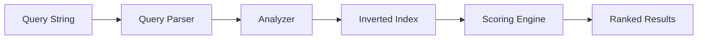

# Full-Text Search in Azure AI Search

Full-text search matches on plain text stored in an index using tokenization, lexical analysis, and BM25 relevance ranking.

## How Full-Text Search Works

### Query Execution Stages

<Steps>
  <Step title="Query Parsing">
    Separate terms from operators, create query tree structure
  </Step>
  
  <Step title="Lexical Analysis">
    Tokenize, lowercase, remove stop words, stem to root forms
  </Step>
  
  <Step title="Document Retrieval">
    Scan inverted indexes for matching terms
  </Step>
  
  <Step title="Scoring">
    Rank documents by relevance using BM25 algorithm
  </Step>
</Steps>

## Query Architecture



## Text Analysis

### Analyzers

Transform text during indexing and querying:

**Standard Analyzer** (default):
- Lowercase all terms
- Remove punctuation
- Split on whitespace
- Remove stop words ("the", "and", "is")

**Language Analyzers**:
- 56 languages supported
- Language-specific stemming
- Stop word lists

**Custom Analyzers**:
- Define tokenization rules
- Configure character filters
- Specify token filters

### Example Analysis

Input: `"The Quick Brown Fox"`

**Standard Analyzer**:
1. Tokenize: ["The", "Quick", "Brown", "Fox"]
2. Lowercase: ["the", "quick", "brown", "fox"]
3. Remove stop words: ["quick", "brown", "fox"]

Result: `["quick", "brown", "fox"]`

## BM25 Ranking

Default relevance algorithm combining:

### Term Frequency (TF)
How often the term appears in the document

### Inverse Document Frequency (IDF)
How rare the term is across all documents

### Field Length Normalization
Shorter fields weighted higher

**Formula**:
```
score(D,Q) = Σ IDF(qi) × (f(qi,D) × (k1 + 1)) / (f(qi,D) + k1 × (1 - b + b × |D|/avgdl))
```

Where:
- D = document
- Q = query
- qi = query term i
- f(qi,D) = term frequency
- |D| = document length
- avgdl = average document length
- k1, b = tuning parameters

## Query Syntax

### Simple Syntax

Default, user-friendly syntax:

**Boolean Operators**:
```
luxury AND hotel
beach OR pool
spa -massage
```

**Phrase Search**:
```
"ocean view"
```

**Prefix Search**:
```
hot*  // matches hotel, hotels, hotspot
```

**Grouping**:
```
(luxury OR premium) AND hotel
```

### Full Lucene Syntax

Advanced features (requires `"queryType": "full"`):

**Fielded Search**:
```
title:luxury description:beachfront
```

**Fuzzy Search**:
```
seatle~  // matches seattle
```

**Proximity Search**:
```
"ocean view"~5  // within 5 words
```

**Term Boosting**:
```
luxury^2 hotel  // boost "luxury" 2x
```

**Regular Expressions**:
```
/[mh]otel/  // matches motel, hotel
```

**Wildcard**:
```
hot?l  // matches hotel, hotol
```

## Query Parameters

### Search Fields

Limit search to specific fields:

```json
{
  "search": "luxury hotel",
  "searchFields": "title,description,tags"
}
```

### Search Mode

Control boolean logic:

```json
{
  "search": "luxury hotel spa",
  "searchMode": "all"  // AND (default: "any" = OR)
}
```

### Query Type

Choose parser:

```json
{
  "search": "title:luxury^2",
  "queryType": "full"  // default: "simple"
}
```

## Filters

Combine with filters for precise results:

```json
{
  "search": "beach hotel",
  "filter": "rating ge 4.5 and priceRange eq 'high'",
  "orderby": "rating desc"
}
```

**Filter Functions**:
- Comparison: `eq`, `ne`, `gt`, `lt`, `ge`, `le`
- Logical: `and`, `or`, `not`
- Functions: `search.in()`, `geo.distance()`

## Faceted Navigation

Generate category counts:

```json
{
  "search": "hotel",
  "facets": [
    "category",
    "rating,interval:1",
    "priceRange"
  ]
}
```

**Response**:
```json
{
  "@search.facets": {
    "category": [
      {"value": "Luxury", "count": 42},
      {"value": "Budget", "count": 38}
    ],
    "rating": [
      {"value": 4, "count": 15},
      {"value": 5, "count": 27}
    ]
  }
}
```

## Relevance Tuning

### Scoring Profiles

Boost specific fields or values:

```json
{
  "scoringProfiles": [
    {
      "name": "boost-title",
      "text": {
        "weights": {
          "title": 3,
          "description": 1
        }
      }
    }
  ]
}
```

Apply in query:

```json
{
  "search": "luxury hotel",
  "scoringProfile": "boost-title"
}
```

### Freshness Boosting

Boost recent documents:

```json
{
  "scoringProfiles": [
    {
      "name": "boost-recent",
      "functions": [
        {
          "type": "freshness",
          "fieldName": "lastModified",
          "boost": 2.0,
          "freshness": {
            "boostingDuration": "P30D"  // 30 days
          }
        }
      ]
    }
  ]
}
```

## Highlighting

Show matching snippets:

```json
{
  "search": "luxury hotel",
  "highlight": "description",
  "highlightPreTag": "<mark>",
  "highlightPostTag": "</mark>"
}
```

**Response**:
```json
{
  "@search.highlights": {
    "description": [
      "Experience <mark>luxury</mark> at our beachfront <mark>hotel</mark>"
    ]
  }
}
```

## Best Practices

<AccordionGroup>
  <Accordion title="Analyzer Selection">
    - Use language analyzers for specific languages
    - Custom analyzers for domain-specific terms
    - Test with representative queries
  </Accordion>
  
  <Accordion title="Field Design">
    - Mark fields searchable only when needed
    - Use separate fields for exact vs analyzed matching
    - Consider field length impact on scoring
  </Accordion>
  
  <Accordion title="Query Optimization">
    - Use filters to reduce search scope
    - Avoid wildcard prefixes (slow)
    - Limit searchFields to relevant fields
  </Accordion>
  
  <Accordion title="Relevance Tuning">
    - Start with default BM25
    - Add scoring profiles incrementally
    - A/B test changes with users
  </Accordion>
</AccordionGroup>

## Common Patterns

### Product Search

```json
{
  "search": "wireless headphones",
  "searchFields": "name,description,brand",
  "filter": "price le 200 and inStock eq true",
  "orderby": "rating desc",
  "facets": ["brand", "priceRange", "rating"]
}
```

### Document Search

```json
{
  "search": "quarterly financial report",
  "searchFields": "title,content",
  "filter": "year eq 2024 and department eq 'Finance'",
  "highlight": "content"
}
```

## Next Steps

<CardGroup cols={2}>
  <Card title="Vector Search" icon="diagram-project" href="/search/queries/vector">
    Add semantic similarity search
  </Card>
  
  <Card title="Hybrid Search" icon="magnifying-glass" href="/search/concepts/hybrid-search">
    Combine text and vector queries
  </Card>
  
  <Card title="Query Examples" icon="code" href="https://learn.microsoft.com/azure/search/search-query-simple-examples">
    More query patterns
  </Card>
</CardGroup>
