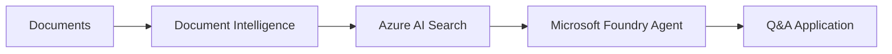
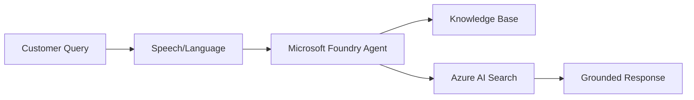
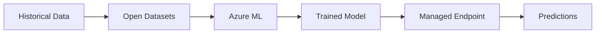

# Azure AI Services Overview

Azure AI provides a comprehensive suite of cloud-based artificial intelligence services designed to help developers and organizations build intelligent applications without requiring deep AI or data science expertise. From agent development to machine learning operations, Azure AI covers the full spectrum of AI capabilities.

## Core Services

Azure AI is built around four core services that work together to provide a complete AI platform:

<CardGroup cols={2}>
  <Card title="Microsoft Foundry" icon="robot" href="/services/ai-foundry">
    **Unified AI Platform**
    
    Build AI agents and generative AI applications on an enterprise-grade platform with cutting-edge models and tools.
    
    - Multi-agent orchestration
    - 1,400+ tool integrations
    - Memory and knowledge capabilities
    - Real-time observability
  </Card>
  
  <Card title="Azure Machine Learning" icon="brain-circuit" href="/services/machine-learning">
    **ML Lifecycle Management**
    
    Accelerate the complete machine learning project lifecycle from training to deployment with enterprise MLOps.
    
    - Automated ML
    - Distributed training
    - Model catalog with LLMs
    - Managed endpoints
  </Card>
  
  <Card title="Azure AI Search" icon="magnifying-glass" href="/services/ai-search">
    **Intelligent Retrieval**
    
    AI-powered information retrieval for rich search experiences and RAG applications with enterprise data.
    
    - Classic and agentic search
    - Vector and hybrid search
    - AI enrichment pipeline
    - Knowledge bases
  </Card>
  
  <Card title="Azure Open Datasets" icon="database" href="/services/open-datasets">
    **Curated Public Data**
    
    Pre-processed public datasets for enriching machine learning models with weather, census, and location data.
    
    - Transportation datasets
    - Economic indicators
    - Weather and climate data
    - Labor force statistics
  </Card>
</CardGroup>

## Foundry Tools (Cognitive Services)

Azure AI includes a comprehensive set of pre-built AI services called Foundry Tools, formerly known as Azure Cognitive Services:

### Vision Services

<Accordion title="Azure Vision">
  Analyze content in images and videos with computer vision capabilities.
  
  **Features:**
  - Image analysis and tagging
  - Object detection
  - Facial recognition
  - OCR (Optical Character Recognition)
  - Spatial analysis
  - Multimodal embeddings
  
  **Use Cases:** Content moderation, document processing, retail analytics, security systems
</Accordion>

<Accordion title="Custom Vision">
  Customize image recognition for your specific business needs.
  
  **Features:**
  - Custom image classification
  - Object detection models
  - Transfer learning
  - Easy deployment
  
  **Use Cases:** Quality control, product identification, specialized image classification
</Accordion>

### Language Services

<Accordion title="Azure Language">
  Build apps with industry-leading natural language understanding.
  
  **Features:**
  - Named entity recognition
  - Sentiment analysis with opinion mining
  - Key phrase extraction
  - Language detection
  - Question answering
  - Conversational language understanding
  
  **Use Cases:** Chatbots, content analysis, document understanding, customer feedback analysis
</Accordion>

<Accordion title="Translator">
  AI-powered translation for 100+ languages and dialects.
  
  **Features:**
  - Real-time translation
  - Document translation
  - Custom translation models
  - Transliteration
  - Dictionary lookup
  
  **Use Cases:** Global applications, content localization, multilingual support
</Accordion>

### Speech Services

<Accordion title="Speech Service">
  Speech to text, text to speech, translation, and speaker recognition.
  
  **Features:**
  - Speech-to-text transcription
  - Text-to-speech synthesis
  - Speech translation
  - Speaker identification
  - Custom voice models
  - Pronunciation assessment
  
  **Use Cases:** Voice assistants, transcription services, accessibility features, call center analytics
</Accordion>

### Document & Content Services

<Accordion title="Document Intelligence">
  Turn documents into intelligent data-driven solutions.
  
  **Features:**
  - Pre-built document models (invoices, receipts, IDs)
  - Custom document models
  - Layout analysis
  - Table extraction
  - Form field extraction
  
  **Use Cases:** Document processing automation, invoice processing, form digitization
</Accordion>

<Accordion title="Content Understanding">
  Analyze and comprehend various media content types.
  
  **Features:**
  - Multi-modal content analysis
  - Content classification
  - Scene detection
  - Audio analysis
  
  **Use Cases:** Media management, content curation, digital asset management
</Accordion>

<Accordion title="Content Safety">
  Detect unwanted content with AI-powered moderation.
  
  **Features:**
  - Text moderation
  - Image moderation
  - Harmful content detection
  - Custom blocklists
  - Severity scoring
  
  **Use Cases:** Social platforms, user-generated content, chat moderation
</Accordion>

### Reading & Accessibility

<Accordion title="Immersive Reader">
  Help users read and comprehend text with inclusive design.
  
  **Features:**
  - Text-to-speech
  - Translation
  - Grammar highlighting
  - Reading comprehension tools
  - Focus mode
  
  **Use Cases:** Educational apps, accessibility features, language learning
</Accordion>

## Service Comparison

### When to Use Each Service

| Service | Best For | Key Strength |
|---------|----------|-------------|
| **Microsoft Foundry** | Building agents, generative AI apps | Unified platform with agent orchestration |
| **Azure Machine Learning** | Custom ML models, MLOps | Complete ML lifecycle management |
| **Azure AI Search** | Search functionality, RAG apps | Information retrieval with AI enrichment |
| **Foundry Tools** | Pre-built AI capabilities | Ready-to-use APIs for common tasks |
| **Open Datasets** | Data enrichment | Pre-processed public datasets |

## Integration Patterns

### Cross-Service Workflows

Azure AI services are designed to work together seamlessly:

<Steps>
  <Step title="Data Preparation">
    Use **Open Datasets** to enrich your training data with external signals like weather, location, or economic indicators.
  </Step>
  
  <Step title="Model Development">
    Build custom models with **Azure Machine Learning** or use pre-built models from **Microsoft Foundry**.
  </Step>
  
  <Step title="Content Processing">
    Apply **Foundry Tools** (Vision, Language, Document Intelligence) to extract and structure information from raw content.
  </Step>
  
  <Step title="Information Retrieval">
    Index processed content in **Azure AI Search** for fast retrieval and RAG applications.
  </Step>
  
  <Step title="Agent Integration">
    Connect everything through **Microsoft Foundry** agents that orchestrate tools and knowledge sources.
  </Step>
</Steps>

## Common Use Cases

### Intelligent Document Processing

Combine Document Intelligence to extract structure, AI Search to index content, and Foundry agents to answer questions.

### Customer Service Automation

Use Speech/Language services for input, Foundry agents for orchestration, and AI Search for knowledge retrieval.

### Predictive Analytics

Enrich data with Open Datasets, train models in Azure ML, and deploy for real-time predictions.

## Regional Availability

Azure AI services are available in most Azure regions worldwide:

<Note>
  **Important**: Not all features are available in all regions. Some advanced capabilities like agentic retrieval in AI Search or specific model deployments in Foundry have regional restrictions.
  
  Check the [region support documentation](https://learn.microsoft.com/azure/ai-services/language-support) for your specific services.
</Note>

### Recommended Regions

- **North America**: East US, West US 2, Canada Central
- **Europe**: West Europe, North Europe, UK South
- **Asia Pacific**: Southeast Asia, East Asia, Australia East

## Pricing Overview

Azure AI services use different pricing models:

<Tabs>
  <Tab title="Pay-As-You-Go">
    Most Foundry Tools use transaction-based pricing:
    - Charged per API call or transaction
    - No upfront commitment
    - Scales with usage
    - Free tiers available for testing
  </Tab>
  
  <Tab title="Commitment Tiers">
    Some services offer discounted commitment pricing:
    - Predictable monthly costs
    - Significant discounts for high volume
    - Overage charges for exceeding commitment
    - Available for Vision, Language, Speech
  </Tab>
  
  <Tab title="Compute-Based">
    Azure Machine Learning and Foundry:
    - Charged for compute resources (VMs, GPUs)
    - Storage costs separate
    - Free platform usage (only pay for compute)
    - Auto-shutdown to save costs
  </Tab>
  
  <Tab title="Search Units">
    Azure AI Search uses search unit pricing:
    - Based on replicas and partitions
    - Fixed monthly cost per tier
    - Free tier available
    - Scale up/down as needed
  </Tab>
</Tabs>

<Tip>
  **Cost Optimization**: Use the free tier for development and testing. Enable auto-shutdown for compute instances. Monitor usage with Azure Cost Management.
</Tip>

## Security & Compliance

All Azure AI services include enterprise-grade security:

- **Authentication**: Microsoft Entra ID, managed identities, API keys
- **Network Security**: Virtual networks, private endpoints, firewalls
- **Data Protection**: Encryption at rest and in transit
- **Compliance**: HIPAA, ISO, SOC, GDPR, FedRAMP
- **Access Control**: Role-based access (RBAC), resource-level policies
- **Audit Logging**: Azure Monitor, diagnostic logs

## Development Tools

Azure AI services support multiple development approaches:

### SDKs Available

- **Python**: Most comprehensive SDK support
- **C# / .NET**: Full-featured enterprise SDKs
- **JavaScript/TypeScript**: Node.js and browser support
- **Java**: Enterprise application integration
- **REST APIs**: Language-agnostic HTTP APIs

### Development Environments

- **Azure Portal**: Web-based resource management
- **Azure CLI**: Command-line automation
- **VS Code Extensions**: Local development experience
- **Jupyter Notebooks**: Interactive data science
- **Azure Machine Learning Studio**: Visual ML development
- **Microsoft Foundry Portal**: Agent and model development

## Getting Started

Ready to start building with Azure AI?

<CardGroup cols={2}>
  <Card title="Quickstart Guide" icon="rocket" href="/quickstart">
    Create your first AI project in minutes
  </Card>
  
  <Card title="Service Details" icon="book" href="/services/ai-foundry">
    Explore individual service capabilities
  </Card>
  
  <Card title="Code Samples" icon="code" href="/samples">
    Browse working examples and templates
  </Card>
  
  <Card title="Architecture Patterns" icon="sitemap" href="/architecture">
    Learn best practices and design patterns
  </Card>
</CardGroup>

## Additional Resources

- [Azure AI Services Pricing](https://azure.microsoft.com/pricing/details/cognitive-services/)
- [Service Level Agreements (SLA)](https://azure.microsoft.com/support/legal/sla/)
- [Azure AI Blog](https://azure.microsoft.com/blog/topics/artificial-intelligence/)
- [Microsoft Learn Training](https://learn.microsoft.com/training/azure/)
- [GitHub Samples](https://github.com/Azure-Samples)